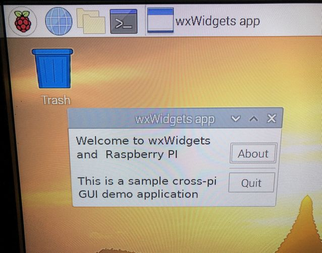
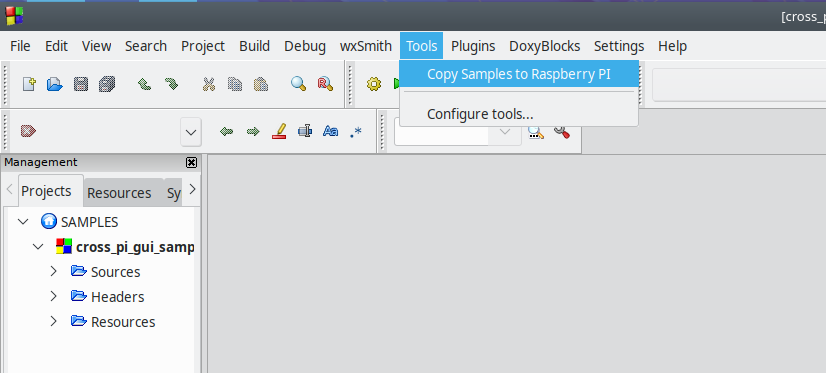

# cross-pi
Ubuntu cross compilation to Raspberry PI

cross-pi is a Raspberry PI cross-compiler environment for Kubuntu or Ubuntu, enabling  development of Raspberry PI executables from an Ubuntu machine.  It is a work in progress and must be considered incomplete in some areas, however the samples work.  If you have bug reports or suggested improvements please submit an issue, and it will be considered (no promises though). It is advised to follow these procedures under a disposable **virtual machine only**, as that ensures an extra layer of safety if something fails. See also the [LICENSE](LICENSE).

By following this description and running the scripts, the cross compiler will be built with supporting libraries. On completion, a directory structure will be created:

    $HOME/cross-pi                ... Clone of https://github.com/arnholm/cross-pi
    $HOME/cross-pi-build          ... Build area
                    /buildroot    ... Raspberry PI cross compiler (buildroot.org)
                    /libraries    ... Cross compiled optional libraries
                    /samples      ... Sample applications to build with cross compiler
						  
The cross compiler is generated using the tools from [https://buildroot.org/](https://buildroot.org/), see also their [User Manual](https://buildroot.org/downloads/manual/manual.html).
  
---

## Step 1: System preparations

Prepare the operating systems of Ubuntu and Raspberry PI.

**Install [Kubuntu](https://kubuntu.org/) or [Ubuntu](https://ubuntu.com/)** - 18.04 or newer
  * Install under Virtual Box 
  * Give it a virtual disk of 40GB or more
  * Install git: _sudo apt install git_
  * From $HOME, clone the repo: _git clone https://github.com/arnholm/cross-pi_ 
  * _Optional: Install Notepadqq text editor from the script in the utilities folder_
  * _Optional: configure network disks (/etc/fstab)_.

**cross-pi-bootstrap.sh** - Installs essential Ubuntu system packages required for the other scripts to work.

---
 
**Install [Raspbian](https://www.raspberrypi.org/downloads/raspbian/) on the PI** - Buster or newer
  * These steps simplify deployment of cross compiled applications to the host PI
  * Enable SSH, use [raspi-config](https://learn.adafruit.com/adafruits-raspberry-pi-lesson-2-first-time-configuration/overview) to do it.
  * Define  <a href="https://raspberrypi.stackexchange.com/questions/37920/how-do-i-set-up-networking-wifi-static-ip-address</a>">static-ip-address</a>. 
    Use "dhcpcd method", editing /etc/dhcpcd.conf
  * _Optional: configure network disks (/etc/fstab)_.

---

## Step 2: cross-pi compiler toolchain
This builds the Raspberry PI cross-compiler toolchain from [https://buildroot.org/](https://buildroot.org/) under Ubuntu. 

**cross-pi-buildroot.sh** - Builds and installs the cross compiler toolchain. This process requires some user interaction (optionally, perform the steps in the script manually). When the buildroot configuration tool starts, make the following additions (for wxWidgets)

* Toolchain  =>  C library  => (x)  glibc
* Target packages => Graphics libraries and applications => [x] x.org X Window System	
* Target packages => Libraries => Graphics => [x] libgtk2
* Target packages => Libraries => [x] Cairo

Use File => Save before exiting. You will be asked whether to build the toolchain immediately or do it manually later  (be prepared for 2+ hour build). To manually build the toolchain, issue the commands below. 

    cd ~/cross-pi-build/buildroot
    make
 
After successful build, the cross compiler toolchain is found in this folder:

    ~/cross-pi-build/buildroot/output/host/usr/bin
    
When compiling/linking with this toolchain the g++ compiler should be called with the _--sysroot=DIR_ option, where DIR is as below.
    
    ~/cross-pi-build/buildroot/output/host/arm-buildroot-linux-gnueabihf/sysroot/
    
	 
|Tool| cross-pi name|
|--|--|
|C compiler| arm-linux-gcc|
|C++ compiler| arm-linux-g++ |
| linker for dynamic libs | arm-linux-g++ |
| linker for static libs | arm-linux-ar |
 
If all you wanted was a cross-compiler, your journey could end here. For libraries and other tools, keep reading.

---
  
## Step 3: cross-pi libraries 

See the libraries subfolder for the scripts mentioned here. 

You must complete the **cross-pi-buildroot.sh** step before running either of them, since they depend on the cross-compiler. Even if you don't plan to build or use these libraries, they serve as examples for how to use the cross-compiler from various build systems.

3.1 **cross-pi-boost.sh** - Builds cross-pi version of boost libraries
  * Skip this if you don't use boost
  * Uses the cross-compiler with boost jam-file build system
  * Installs to _libraries/boost-[version]_

3.2 **cross-pi-wxwidgets.sh** - Builds cross-pi version of wxWidgets libraries
  * Skip this if you don't use wxWidgets
  * Uses the cross-compiler with configure/make build system
  * Build wxWidgets as static libraries
  * Installs to _libraries/wxwidgets-[version]_

3.3 **cross-pi-msgpack-c.sh** - Builds cross-pi version of msgpack-c 
  * Skip this if you don't use msgpack-c
  * Uses the cross-compiler with cmake build system
  * Installs to _libraries/msgpack-c_

---

## Step 4: Code::Blocks IDE 

See the codeblocks subfolder for the scripts mentioned here.

**cross-pi-codeblocks.sh** - Installs Code::Blocks IDE and configures it to use with the cross compiler toolchain. You will be asked  whether to install Code::Blocks from Ubuntu repository (fast, but old version) or build from source (slower, but up to date). 

## Step 5: Compile and run samples

See the samples subfolder for the scripts mentioned here. This step requires steps 1-4 to be completed first.

**cross-pi-samples.sh** - Copies the sample application source code to the build area. To build the sample applications, open the Code::Blocks workspace file and build

    ~/cross-pi-build/samples/SAMPLES.workspace 
    
When built successfully, the Raspberry PI executables are copied to the staging area at

    ~/cross-pi-build/samples/stage
    
**cross-pi-scp.sh** - Copies the cross-compiled executable(s) found in the staging area to the host Raspberry PI. This requires SSH to be enabled on the PI. This script can also be accessed via the Tools menu in Code::Blocks

